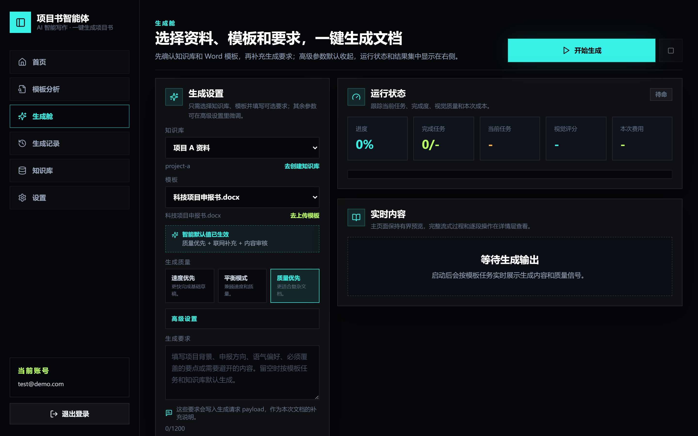
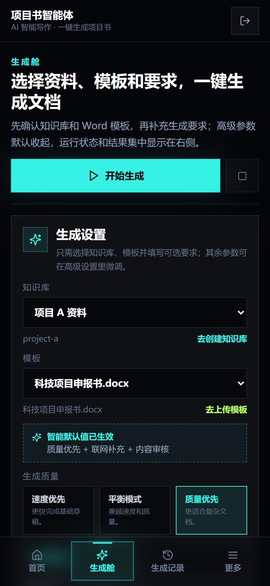
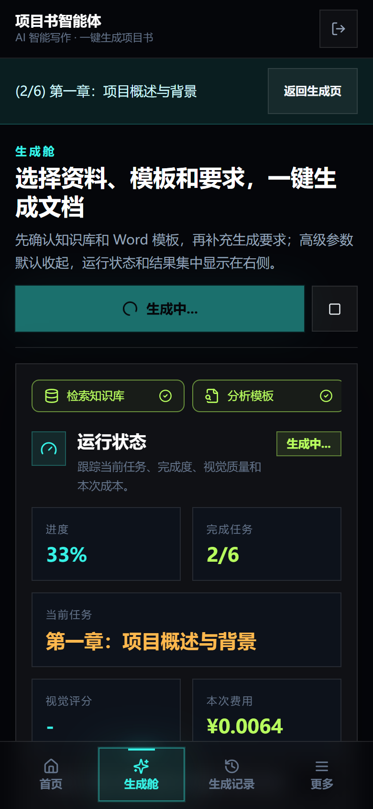
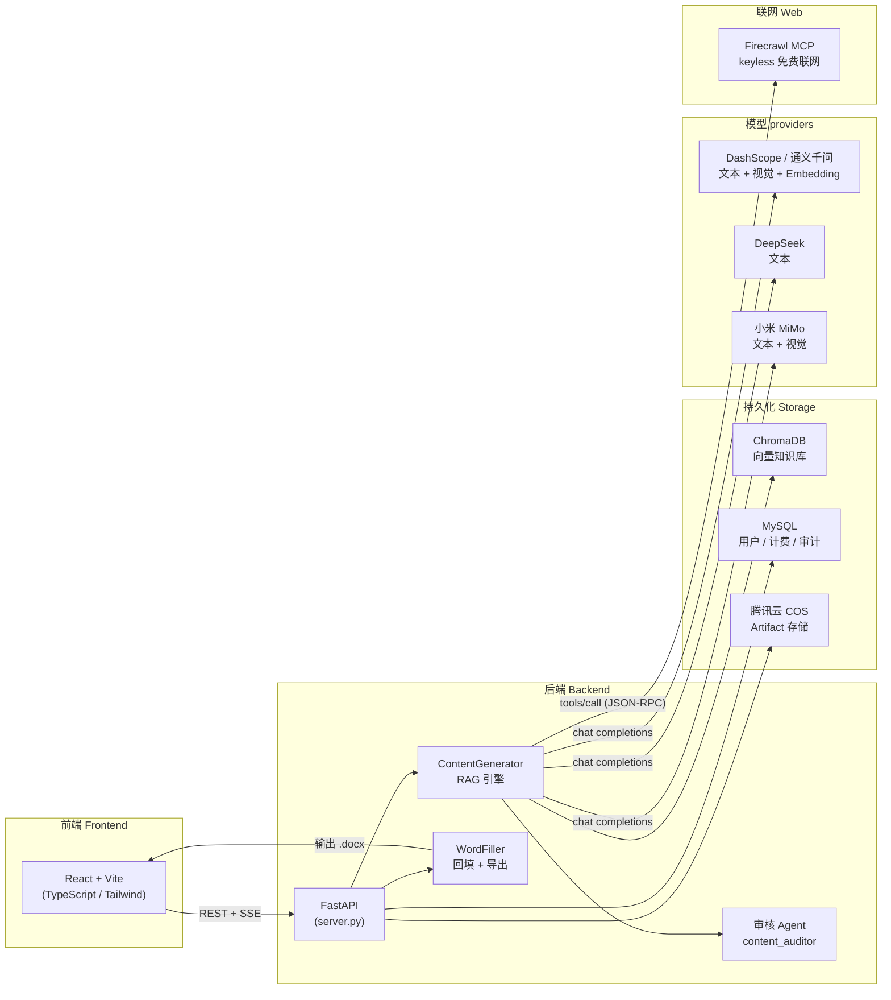
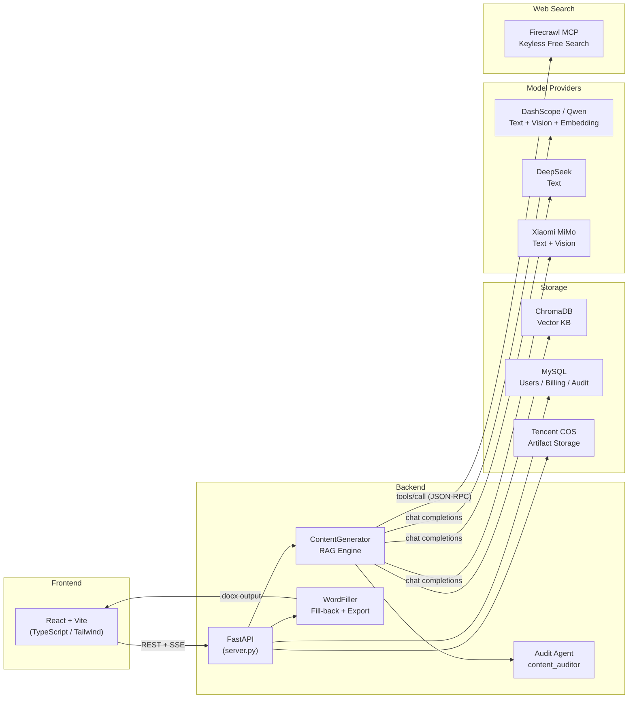

<div align="center">

# 智能文档生成系统

### 智能项目计划书（申报类文档）生成系统
### Local RAG-assisted Proposal Writing Platform

**本地化 RAG 辅助写作系统：机构材料入库为向量知识库，Word 模板锚点自动解析，LLM 逐段生成正文并回填到 Word 定稿。**

**Local RAG-assisted writing system: ingest institutional materials into a vector knowledge base, parse Word template anchors automatically, generate body text segment-by-segment via LLM, and fill results back into the final Word document.**

<br>

[](LICENSE)
[](https://www.python.org/downloads/)
[](https://vitejs.dev/)
[](CONTRIBUTING.md)

</div>

---

## 🇨🇳 截图预览 / 📸 Screenshots

| 桌面端生成界面 | 生成空闲态 | 移动端生成中 |
|:---:|:---:|:---:|
|  |  |  |

---

## 🇨🇳 为什么需要智能文档生成系统

申报类文档（项目计划书、基金说明书、合规披露表）版式固定、章节重复性高，但事实与合规约束极严。机构材料散落在 Word、PDF、PPT、扫描件中，缺乏统一检索入口；模板由法务或合规提供，必须以 Word 定稿。纯大模型从零撰写容易产生与机构材料不一致的幻觉；完全依赖人工摘抄则周期长、易遗漏。

| 痛点 | 智能文档生成系统的对策 |
|:---|:---|
| **P1** 多格式资料难以统一检索 | 解析 docx / pdf / pptx / 图片，分块后入 Chroma 向量库，按语义检索 |
| **P2** 模板空位形态多样（空白、下划线、表格格） | 锚点 `{{NAME}}` 精确绑定；无锚点时小模型 JSON 分析结构 |
| **P3** 长文档一次性生成不可控 | 按 `FillTask` 分段生成，每段绑定章节与字数上限 |
| **P4** 知识库覆盖不足时仍要写满 | Firecrawl 免费联网补料（无需 API key）；提示词要求无据处显式声明，不得杜撰关键事实 |
| **P5** 交付物必须是可编辑 Word | `python-docx` 结构化回填 + 轻量清理 Markdown 痕迹 |

## 🇬🇧 Why Choose the Local RAG-assisted Proposal Writing Platform

Application documents (project proposals, fund prospectuses, compliance disclosures) have fixed layouts and highly repetitive sections, but strict factual and compliance constraints. Institutional materials are scattered across Word, PDF, PPT, and scans with no unified search entry point. Templates come from legal or compliance teams and must be finalized in Word. Pure LLM drafting from scratch tends to hallucinate facts inconsistent with institutional materials; relying entirely on manual extraction is slow and error-prone.

| Pain Point | How It Solves It |
|:---|:---|
| **P1** Multi-format materials are hard to search uniformly | Parse docx / pdf / pptx / images, chunk and ingest into Chroma vector store, retrieve by semantic similarity |
| **P2** Template blanks come in many forms (empty fields, underlines, table cells) | Anchor `{{NAME}}` for precise binding; small-model JSON analysis when no anchors present |
| **P3** Long documents are uncontrollable in a single generation pass | Segment by `FillTask`, each bound to a chapter and word limit |
| **P4** Still need to fill content when knowledge base coverage is insufficient | Firecrawl keyless web search (no API key needed); prompts require explicit disclosure when evidence is missing, never fabricate key facts |
| **P5** Deliverables must be editable Word files | `python-docx` structured fill-back + lightweight Markdown cleanup |

---

## 🇨🇳 功能特性

- **多格式知识库**：支持 .docx / .pdf / .pptx / 图片入库，滑动窗口分块（约 700 字 / 块，120 字重叠），Chroma 向量持久化，多库切换
- **Word 模板解析与锚点回填**：正则扫描 `{{ANCHOR}}` 生成 FillTask；无锚点时 LLM 分析模板结构；表格格、段落、空白位全覆盖
- **RAG 分段生成**：每段绑定章节语义查询，检索结果注入提示词，字数上限按任务类型分档
- **Firecrawl 免费联网补料**：keyless MCP 协议，无需 API key，知识库弱覆盖或低相似度时自动触发联网检索
- **多模型支持**：DashScope / 通义千问（文本 + 视觉 + Embedding）、DeepSeek（文本）、小米 MiMo（文本 + 视觉），统一走 OpenAI SDK 兼容接口
- **内容审核 + 视觉审核**：规则优先 + 模型质检，major issue 自动重试生成 1 次；模板视觉摘要注入提示词减少答非所问
- **流式预览 + 路由日志追踪**：SSE 流式输出，每段生成记录路由元数据（模型、是否联网、kb 命中数、估算相似度），便于审计与复现
- **生成强度预设**：快速 / 普通 / 增强三档，自动调整 top_k、检索距离、联网开关、字数上限
- **用户认证与计费**：JWT 认证、邮箱验证、API key 管理、用量记录
- **artifact 存储**：支持腾讯云 COS 对象存储，生成结果可下载

## 🇬🇧 Features

- **Multi-format knowledge base**: Ingest .docx / .pdf / .pptx / images, sliding-window chunking (~700 chars / chunk, 120 char overlap), Chroma vector persistence, multi-KB switching
- **Word template parsing & anchor fill-back**: Regex scan for `{{ANCHOR}}` to generate FillTasks; LLM structure analysis when no anchors; covers table cells, paragraphs, and blank fields
- **RAG segmented generation**: Each segment bound to chapter-semantic query, retrieved evidence injected into prompts, word limits tiered by task type
- **Firecrawl keyless web search**: MCP protocol, no API key required, auto-triggers when knowledge base coverage is weak or similarity is low
- **Multi-model support**: DashScope / Qwen (text + vision + embedding), DeepSeek (text), Xiaomi MiMo (text + vision), all via OpenAI SDK compatible interface
- **Content audit + visual audit**: Rule-first + model-based quality check, auto-retry once on major issues; template vision summary injected into prompts to reduce off-target answers
- **Streaming preview + route log tracing**: SSE streaming output, per-segment route metadata logging (model, web search flag, KB hit count, estimated similarity) for audit and reproducibility
- **Generation strength presets**: Quick / Normal / Enhanced tiers, auto-adjusting top_k, retrieval distance, web search toggle, word limits
- **User auth & billing**: JWT authentication, email verification, API key management, usage tracking
- **Artifact storage**: Tencent COS object storage support, generated files downloadable

---

## 🇨🇳 系统架构



## 🇬🇧 Architecture



---

## 🇨🇳 快速开始

### 1. 克隆仓库

```bash
git clone https://github.com/your-org/xiangmushu.git
cd xiangmushu
```

### 2. 创建 Python 虚拟环境

```bash
python -m venv venv
# Windows
venv\Scripts\activate
# macOS / Linux
source venv/bin/activate
```

### 3. 安装后端依赖

```bash
pip install -r requirements.txt
```

### 4. 配置环境变量

```bash
cp .env.example .env
```

编辑 `.env`，填入必填项：

```ini
# 必填：大模型 API Key
DASHSCOPE_API_KEY=sk-xxxxxxxxxxxxxxxxxxxxxxxx

# 必填：MySQL 数据库（或设置 PERSISTENCE_MODE=sqlite 使用本地 SQLite）
MYSQL_HOST=127.0.0.1
MYSQL_PORT=3306
MYSQL_USER=root
MYSQL_PASSWORD=your_password
MYSQL_DATABASE=xiangmushu

# 可选：JWT 签名密钥（生产环境必须设置）
AUTH_JWT_SECRET=your-random-secret-here
```

### 5. 启动后端服务

```bash
python server.py
# 或
uvicorn server:app --host 0.0.0.0 --port 8502
```

后端运行在 `http://localhost:8502`。

### 6. 启动前端开发服务器

```bash
cd frontend
npm install
npm run dev
```

前端运行在 `http://localhost:5173`，自动代理 API 请求到后端。

## 🇬🇧 Quick Start

### 1. Clone the repository

```bash
git clone https://github.com/your-org/xiangmushu.git
cd xiangmushu
```

### 2. Create a Python virtual environment

```bash
python -m venv venv
# Windows
venv\Scripts\activate
# macOS / Linux
source venv/bin/activate
```

### 3. Install backend dependencies

```bash
pip install -r requirements.txt
```

### 4. Configure environment variables

```bash
cp .env.example .env
```

Edit `.env` and fill in required fields:

```ini
# Required: LLM API key
DASHSCOPE_API_KEY=sk-xxxxxxxxxxxxxxxxxxxxxxxx

# Required: MySQL database (or set PERSISTENCE_MODE=sqlite for local SQLite)
MYSQL_HOST=127.0.0.1
MYSQL_PORT=3306
MYSQL_USER=root
MYSQL_PASSWORD=your_password
MYSQL_DATABASE=xiangmushu

# Optional: JWT signing secret (must set in production)
AUTH_JWT_SECRET=your-random-secret-here
```

### 5. Start the backend server

```bash
python server.py
# or
uvicorn server:app --host 0.0.0.0 --port 8502
```

Backend runs at `http://localhost:8502`.

### 6. Start the frontend dev server

```bash
cd frontend
npm install
npm run dev
```

Frontend runs at `http://localhost:5173`, proxying API requests to the backend.

---

## 🇨🇳 配置说明

所有配置通过环境变量或 `.env` 文件注入，参考 `.env.example`。

### 大模型配置

| 变量 | 说明 | 默认值 |
|:---|:---|:---|
| `DASHSCOPE_API_KEY` | 阿里云百炼 API Key | 必填 |
| `OPENAI_BASE_URL` | OpenAI 兼容接口地址 | `https://dashscope.aliyuncs.com/compatible-mode/v1` |
| `OPENAI_API_KEY` | OpenAI 兼容 Key（留空则用 DASHSCOPE_API_KEY） | 同 DASHSCOPE_API_KEY |
| `EMBEDDING_MODEL` | 向量模型 | `text-embedding-v3` |

### 模型路由

| 变量 | 说明 | 默认值 |
|:---|:---|:---|
| `LARGE_LLM_MODEL` | 主写作模型 | `qwen3.7-plus` |
| `SMALL_LLM_MODEL` | 模板分析等轻量任务 | `qwen3.7-plus` |
| `VISION_WEB_MODEL` | 视觉辅助模型（模板视觉等） | `qwen3.7-plus` |
| `AUDIT_LLM_MODEL` | 审核模型 | `qwen3.7-plus` |

### 持久化配置

| 变量 | 说明 | 默认值 |
|:---|:---|:---|
| `PERSISTENCE_MODE` | 持久化模式 | `mysql` |
| `MYSQL_HOST` | MySQL 主机 | 必填 |
| `MYSQL_PORT` | MySQL 端口 | `3306` |
| `MYSQL_DATABASE` | 数据库名 | 必填 |
| `MYSQL_AUTO_CREATE_DATABASE` | 自动建库 | `1` |
| `MYSQL_AUTO_MIGRATE` | 自动迁移 | `1` |

### Firecrawl 联网搜索

| 变量 | 说明 | 默认值 |
|:---|:---|:---|
| `FIRECRAWL_ENABLED` | 是否启用联网搜索 | `1` |
| `FIRECRAWL_MCP_URL` | Firecrawl MCP 端点 | `https://mcp.firecrawl.dev/v2/mcp` |
| `FIRECRAWL_SEARCH_LIMIT` | 每次搜索返回结果数 | `5` |
| `FIRECRAWL_TIMEOUT` | 请求超时（秒） | `30` |

## 🇬🇧 Configuration

All configuration is injected via environment variables or `.env` file. See `.env.example` for the full list.

### LLM Configuration

| Variable | Description | Default |
|:---|:---|:---|
| `DASHSCOPE_API_KEY` | Alibaba Cloud DashScope API key | Required |
| `OPENAI_BASE_URL` | OpenAI-compatible API endpoint | `https://dashscope.aliyuncs.com/compatible-mode/v1` |
| `OPENAI_API_KEY` | OpenAI-compatible key (falls back to DASHSCOPE_API_KEY) | Same as DASHSCOPE_API_KEY |
| `EMBEDDING_MODEL` | Embedding model name | `text-embedding-v3` |

### Model Routing

| Variable | Description | Default |
|:---|:---|:---|
| `LARGE_LLM_MODEL` | Main writing model | `qwen3.7-plus` |
| `SMALL_LLM_MODEL` | Lightweight tasks (template analysis, etc.) | `qwen3.7-plus` |
| `VISION_WEB_MODEL` | Vision-assisted model (template vision, etc.) | `qwen3.7-plus` |
| `AUDIT_LLM_MODEL` | Audit / quality-check model | `qwen3.7-plus` |

### Persistence

| Variable | Description | Default |
|:---|:---|:---|
| `PERSISTENCE_MODE` | Storage backend | `mysql` |
| `MYSQL_HOST` | MySQL host | Required |
| `MYSQL_PORT` | MySQL port | `3306` |
| `MYSQL_DATABASE` | Database name | Required |
| `MYSQL_AUTO_CREATE_DATABASE` | Auto-create database | `1` |
| `MYSQL_AUTO_MIGRATE` | Auto-run migrations | `1` |

### Firecrawl Web Search

| Variable | Description | Default |
|:---|:---|:---|
| `FIRECRAWL_ENABLED` | Enable web search | `1` |
| `FIRECRAWL_MCP_URL` | Firecrawl MCP endpoint | `https://mcp.firecrawl.dev/v2/mcp` |
| `FIRECRAWL_SEARCH_LIMIT` | Results per search | `5` |
| `FIRECRAWL_TIMEOUT` | Request timeout (seconds) | `30` |

---

## 🇨🇳 支持的模型服务

| 服务商 | 能力 | 接口 | 说明 |
|:---|:---|:---|:---|
| **DashScope / 通义千问** | 文本生成 + 视觉理解 + Embedding | OpenAI 兼容 (`compatible-mode/v1`) | 默认主服务商，支持 `enable_search` 联网 |
| **DeepSeek** | 文本生成 | OpenAI 兼容 | 可配置为审核模型或备选写作模型 |
| **小米 MiMo** | 文本生成 + 视觉理解 | OpenAI 兼容 | 可作为视觉提取或写作模型 |
| **Firecrawl** | 联网搜索 | MCP (JSON-RPC, keyless) | 免费托管端点，无需 API key，按 IP 限流 |

## 🇬🇧 Supported Model Providers

| Provider | Capabilities | Interface | Notes |
|:---|:---|:---|:---|
| **DashScope / Qwen** | Text + Vision + Embedding | OpenAI-compatible (`compatible-mode/v1`) | Default provider, supports `enable_search` for web augmentation |
| **DeepSeek** | Text generation | OpenAI-compatible | Configurable as audit model or fallback writer |
| **Xiaomi MiMo** | Text + Vision | OpenAI-compatible | Can serve as vision extraction or writing model |
| **Firecrawl** | Web search | MCP (JSON-RPC, keyless) | Free hosted endpoint, no API key needed, rate-limited per IP |

---

## 🇨🇳 项目结构

```
xiangmushu/
├── server.py              # FastAPI 后端入口，REST + SSE 路由
├── config.py              # 全局配置与环境变量加载
├── requirements.txt       # Python 依赖
├── core/                  # 核心业务逻辑
│   ├── generator.py       #   RAG 生成引擎（ContentGenerator + GenerationBundle）
│   ├── vector_store.py    #   Chroma 向量存储封装
│   ├── firecrawl_search.py#   Firecrawl keyless 联网搜索
│   ├── template_analyzer.py#  模板解析（锚点 + LLM 结构分析）
│   ├── filler.py          #   Word 回填引擎
│   ├── content_auditor.py #   内容审核 Agent
│   ├── chunker.py         #   文档分块（滑动窗口）
│   ├── kb_extract.py      #   多格式文档解析入口
│   ├── auth.py            #   用户认证（JWT + 邮箱验证）
│   ├── billing.py         #   计费与 API key 管理
│   └── ...                #   其他模块（query_expander, task_grouper, evidence_planner 等）
├── frontend/              # React 前端
│   ├── src/               #   源码（组件、路由、API 调用）
│   ├── package.json       #   依赖（React 18 + Vite 6 + TypeScript + Tailwind）
│   └── vite.config.ts     #   Vite 配置（API 代理）
├── migrations/            # MySQL 数据库迁移脚本
├── scripts/               # 运维与调试脚本
│   └── probe_firecrawl_mcp.py  # Firecrawl MCP 协议探测
├── tests/                 # pytest 测试套件
├── docs/                  # 文档与截图
│   ├── screenshots/       #   UI 截图
│   └── 测试与验收.md       #   测试说明与矩阵
├── data/                  # 运行时数据（知识库、模板、输出）
├── chroma_db/             # ChromaDB 向量持久化目录
├── smoke_test_models.py   # 离线冒烟测试（路由、审核、分组、JSON 围栏等）
└── .env.example           # 环境变量模板
```

## 🇬🇧 Project Structure

```
xiangmushu/
├── server.py              # FastAPI backend entry point, REST + SSE routes
├── config.py              # Global configuration and env loading
├── requirements.txt       # Python dependencies
├── core/                  # Core business logic
│   ├── generator.py       #   RAG generation engine (ContentGenerator + GenerationBundle)
│   ├── vector_store.py    #   Chroma vector store wrapper
│   ├── firecrawl_search.py#   Firecrawl keyless web search
│   ├── template_analyzer.py#  Template parsing (anchors + LLM structure analysis)
│   ├── filler.py          #   Word fill-back engine
│   ├── content_auditor.py #   Content audit agent
│   ├── chunker.py         #   Document chunking (sliding window)
│   ├── kb_extract.py      #   Multi-format document parsing entry
│   ├── auth.py            #   User authentication (JWT + email verification)
│   ├── billing.py         #   Billing and API key management
│   └── ...                #   Other modules (query_expander, task_grouper, evidence_planner, etc.)
├── frontend/              # React frontend
│   ├── src/               #   Source code (components, routes, API calls)
│   ├── package.json       #   Dependencies (React 18 + Vite 6 + TypeScript + Tailwind)
│   └── vite.config.ts     #   Vite config (API proxy)
├── migrations/            # MySQL database migration scripts
├── scripts/               # Operations and debugging scripts
│   └── probe_firecrawl_mcp.py  # Firecrawl MCP protocol probe
├── tests/                 # pytest test suite
├── docs/                  # Documentation and screenshots
│   ├── screenshots/       #   UI screenshots
│   └── 测试与验收.md       #   Test documentation and matrix
├── data/                  # Runtime data (knowledge base, templates, outputs)
├── chroma_db/             # ChromaDB vector persistence directory
├── smoke_test_models.py   # Offline smoke tests (routing, audit, grouping, JSON fencing, etc.)
└── .env.example           # Environment variable template
```

---

## 🇨🇳 测试

### 后端测试

```bash
# 离线冒烟测试（无需 API key，验证路由、审核、分块、JSON 解析等核心逻辑）
python smoke_test_models.py --offline

# 完整测试套件
pytest

# 带覆盖率的测试
pytest --cov=core --cov-report=term-missing
```

### 前端构建

```bash
cd frontend
npm run build    # TypeScript 类型检查 + Vite 生产构建
npm run preview  # 预览生产构建
```

### 测试理念

项目采用分层测试策略：

- **L0 离线断言**：`smoke_test_models.py --offline` 覆盖路由决策、审核逻辑、query 扩展、分组证据、表格清洗、JSON 围栏等核心逻辑，无需网络和 API key
- **L1 模块集成**：pytest 测试各 core 模块的接口契约
- **L2 端到端**：手动抽检联网路由、锚点模板分析、Word 打开、知识库切换等场景

## 🇬🇧 Testing

### Backend Tests

```bash
# Offline smoke tests (no API key needed, validates routing, audit, chunking, JSON parsing, etc.)
python smoke_test_models.py --offline

# Full test suite
pytest

# With coverage
pytest --cov=core --cov-report=term-missing
```

### Frontend Build

```bash
cd frontend
npm run build    # TypeScript type check + Vite production build
npm run preview  # Preview production build
```

### Testing Philosophy

The project uses a layered testing strategy:

- **L0 Offline assertions**: `smoke_test_models.py --offline` covers routing decisions, audit logic, query expansion, group evidence, table cleaning, JSON fencing, and other core logic without network or API keys
- **L1 Module integration**: pytest tests verify interface contracts of individual core modules
- **L2 End-to-end**: Manual spot-checks for web search routing, anchor template analysis, Word file opening, knowledge base switching, and other scenarios

---

## 🇨🇳 参与贡献

欢迎提交 Issue 和 Pull Request。请先阅读 [CONTRIBUTING.md](CONTRIBUTING.md) 了解开发流程与代码规范。

## 🇬🇧 Contributing

Issues and pull requests are welcome. Please read [CONTRIBUTING.md](CONTRIBUTING.md) for development workflow and code conventions.

---

## 🇨🇳 许可证

本项目基于 [MIT License](LICENSE) 开源。

## 🇬🇧 License

This project is open-sourced under the [MIT License](LICENSE).

---

## 🇨🇳 致谢

- **DashScope / 通义千问**：提供 OpenAI 兼容接口与 Embedding 服务
- **Firecrawl**：提供免费托管 MCP 端点，实现 keyless 联网搜索
- **ChromaDB**：轻量级向量数据库，支持本地持久化
- **OpenAI Python SDK**：兼容模式客户端，统一多模型调用
- **FastAPI**：高性能异步 Web 框架
- **React + Vite**：现代前端工具链

## 🇬🇧 Acknowledgements

- **DashScope / Qwen**: OpenAI-compatible API and embedding services
- **Firecrawl**: Free hosted MCP endpoint for keyless web search
- **ChromaDB**: Lightweight vector database with local persistence
- **OpenAI Python SDK**: Compatible-mode client for unified multi-model calls
- **FastAPI**: High-performance async web framework
- **React + Vite**: Modern frontend toolchain

---

<div align="center">

**智能文档生成系统** 让申报文档写作从「人工摘抄」走向「RAG 辅助 + 结构化回填」。

**Local RAG-assisted Proposal Writing Platform** turns proposal document writing from "manual copy-paste" into "RAG-assisted + structured fill-back".

</div>
