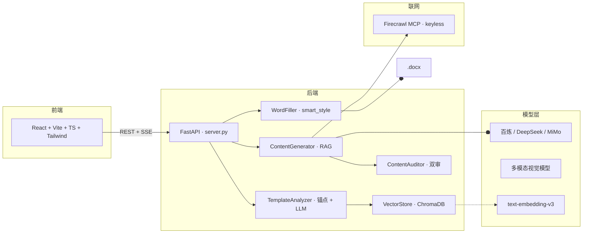

<div align="center">

# 智能文档生成系统

### 本地化 RAG 辅助写作 · Word 模板智能回填

**机构材料入库为向量知识库，LLM 逐段生成正文，自动回填到 Word 定稿。**

<br>

[](LICENSE)
[](https://www.python.org/downloads/)
[](https://vitejs.dev/)

<br>

<a href="http://118.126.102.143/settings" target="_blank" rel="noopener"></a>

<sub>*公开测试环境，可用至 2026 年 11 月*</sub>

</div>

---

## 📸 界面预览

| 桌面端生成 | 空闲态 | 移动端生成中 |
|:---:|:---:|:---:|
|  |  |  |

---

## 🎯 解决什么问题

申报类文档（项目计划书、基金说明书、结课报告、合规披露表）具有：

- **版式固定**：模板由法务/合规提供，必须以 Word 定稿
- **事实严谨**：幻觉不可接受，所有陈述必须有据
- **机构材料散落**：Word / PDF / PPT / 扫描件，无统一检索
- **章节重复**：摘要、背景、创新点、实施方案等高相似结构

纯大模型易幻觉，纯人工摘抄周期长。**本系统 = RAG 检索 + 模板结构化回填**。

---

## ✨ 核心能力

### RAG + LLM 生成引擎

- **多格式知识库**：docx / pdf / pptx / 图片统一解析，滑动窗口分块（~700 字/块）入 Chroma 向量库
- **智能模型路由**：MAIN_WRITER（写作质量）/ FAST_WRITER（强证据短路）/ VISION（多模态表格）自动降级链
- **Firecrawl 免费联网补料**：keyless MCP 协议，无需 API key，知识库弱覆盖时自动触发
- **内容审核 + 视觉审核**：规则 + 模型双审，major issue 自动重试 1 次

### 🆕 智能 Word 排版（doc-gen-revamp）

解决了传统 Word 生成的格式崩塌问题，让输出文档真正可用于交付：

- **Normal-Heading 检测** — 7 信号加权识别 Normal style 下的章节标题（覆盖 80%+ 真实模板）
- **模板样式档案提取** — 从任何 `.docx` 模板提取真实字体/字号/列宽/行距，不再硬编码宋体
- **表格语义分析** — 自动识别 cover_info / rubric_scoring / label_value_pair / innovation_triple 等类型，LABEL 列和评分表不被误填
- **智能样式回填** — 三级优先级（用户偏好 > 模板原始 > 系统默认），支持用户侧自定义字体/字号
- **表格列宽保留** — 不强制等宽，保留模板原始列宽比例；窄列自动扩展到 500 dxa 防止内容溢出
- **上下文增强 Prompt** — 注入文档类型、章节层级路径、表格语义角色到 LLM Prompt，减少内容偏题

### 用户侧体验

- **流式预览 + 路由日志追踪**：SSE 流式输出，每段生成记录路由元数据（模型 / 是否联网 / kb 命中 / 相似度估算）
- **生成强度预设**：快速 / 普通 / 增强三档，自动调整 top_k / 检索距离 / 联网开关 / 字数上限
- **格式偏好 UI**：前端可设置字体 / 字号 / 行距，存 localStorage，按模板隔离
- **多模型支持**：百炼 / DeepSeek / 小米 MiMo 等 OpenAI SDK 兼容接口

---

## 🚀 Quick Start

### 1. 克隆与安装

```bash
git clone https://github.com/your-org/xiangmushu.git
cd xiangmushu
python -m venv venv
venv\Scripts\activate  # Windows
# source venv/bin/activate  # macOS/Linux

pip install -r requirements.txt
```

### 2. 配置

```bash
cp .env.example .env
# 编辑 .env 填入 DASHSCOPE_API_KEY（必填）和 MySQL 配置（可选，默认 SQLite）
```

关键配置项（完整列表见 [.env.example](.env.example)）：

| 变量 | 说明 | 默认值 |
|:---|:---|:---|
| `DASHSCOPE_API_KEY` | 阿里云百炼 API Key | 必填 |
| `LARGE_LLM_MODEL` | 主写作模型 | `qwen3.7-plus` |
| `SMALL_LLM_MODEL` | 轻量任务模型 | `qwen3.7-plus` |
| `EMBEDDING_MODEL` | 向量模型 | `text-embedding-v3` |
| `PERSISTENCE_MODE` | `mysql` 或 `sqlite` | `sqlite` |

### 3. 启动服务

```bash
# 后端
python server.py  # 或 uvicorn server:app --host 0.0.0.0 --port 8502

# 前端
cd frontend && npm install && npm run dev
```

- 后端：`http://localhost:8502`
- 前端：`http://localhost:5173`（自动代理 API）

### 4. 开始生成

1. 在 **知识库** 页面上传你的机构材料（docx/pdf/pptx/图片）
2. 在 **生成** 页面选择模板（或使用内置的智能体/创新计划书模板）
3. 选择生成强度（快速/普通/增强）
4. 点击 **开始生成** → 实时查看流式输出

---

## 📊 架构概览



完整架构细节见 [docs/ARCHITECTURE.md](docs/ARCHITECTURE.md)。

---

## 📁 项目结构

```
xiangmushu/
├── server.py                       # FastAPI 入口
├── config.py                       # 全局配置 (环境变量)
├── core/                           # 核心业务逻辑
│   ├── generator.py                #   RAG 生成引擎
│   ├── template_analyzer.py        #   模板解析 (锚点 + LLM)
│   ├── normal_heading_detector.py  #   🆕 Normal-style 标题检测
│   ├── template_style_extractor.py #   🆕 模板样式档案提取
│   ├── table_semantic_analyzer.py  #   🆕 表格语义分类
│   ├── smart_style.py              #   🆕 智能样式回填
│   ├── document_type_detector.py   #   🆕 文档类型推断
│   ├── chapter_path_builder.py     #   🆕 章节层级路径
│   ├── format_overrides.py         #   🆕 用户格式偏好
│   ├── filler.py                   #   Word 回填
│   ├── content_auditor.py          #   内容审核
│   ├── vector_store.py             #   Chroma 向量存储
│   ├── firecrawl_search.py         #   联网搜索
│   └── kb_extract.py               #   多格式文档解析
├── frontend/                       # React 前端
│   ├── src/pages/GeneratePage.tsx  #   生成页
│   ├── src/pages/generate/         #   生成子组件 (含 FormatOverridesPanel)
│   └── src/api.ts                  #   API 客户端
├── tests/                          # pytest 测试套件
├── docs/                           # 用户文档 (ARCHITECTURE.md 等)
├── scripts/                        # 运维 + 验收脚本
│   ├── showcase_pipeline.py        #   离线 E2E 验收 (7/7 checks)
│   └── real_llm_generation.py      #   真实 LLM E2E 验收
└── openspec/                       # OpenSpec 变更工作流
```

---

## 🧪 测试

### 离线冒烟测试（无需 API Key）

```bash
python smoke_test_models.py --offline
# 路由 / 审核 / query_expander / 表格清洗 / Normal-heading / 表格语义 / 样式提取
```

### 完整测试套件

```bash
pytest
# 292 tests pass（排除 2 个预已存在的失败）

pytest --cov=core
# 覆盖率报告
```

### 端到端管线验收

```bash
# 离线（不调 LLM，验证管线 + 智能样式）
python scripts/showcase_pipeline.py  # 7/7 checks pass

# 真实 LLM（调用百炼，生成真实 .docx）
python scripts/real_llm_generation.py --template innov
# 输出: data/outputs/real_llm_<timestamp>.docx
```

---

## 📚 相关文档

- [自定义模型接入](docs/api-custom-models.md) — 接入 OpenAI SDK 兼容接口
- [多模型功能说明](docs/features/multi-model.md) — 模型角色与降级链
- [MySQL 持久化](docs/mysql-storage-setup.md) — 生产环境 MySQL 配置
- [架构设计详情](docs/ARCHITECTURE.md) — 完整架构 + 接口契约

---

## 🤝 贡献

欢迎提交 Issue 和 Pull Request。重大改动建议先提 Issue 讨论设计方案。

---

## 📄 License

本项目基于 [MIT License](LICENSE) 开源。

---

<div align="center">

**从「人工摘抄」到「RAG + 智能样式 + 结构化回填」**

</div>
