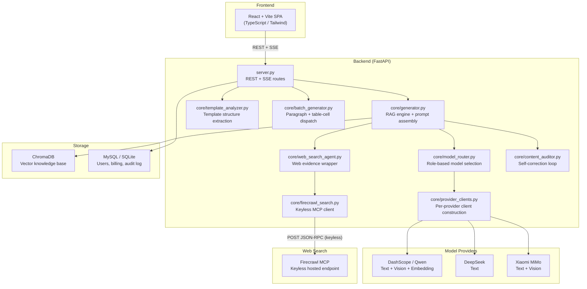

# Architecture

> Engineering reference for the xiangmushu document generation system.
> Last updated: 2026-07-10 (post Firecrawl keyless MCP migration, commit d16966a).

---

## Overview

xiangmushu is a local RAG-assisted writing system for structured application documents (project proposals, fund prospectuses, compliance disclosures). Users ingest institutional materials into a vector knowledge base, upload a Word template with anchors or blank fields, and the system generates body text segment-by-segment via LLM, then fills results back into the Word template for download. The backend is a single-process FastAPI server; the frontend is a React SPA.

---

## High-Level Components



---

## Data Flow

The end-to-end flow for a single generation session:

1. **Document ingestion**: User uploads files (docx, pdf, pptx, images). `core/kb_extract.py` parses each format, `core/chunker.py` applies sliding-window chunking (~700 chars, 120 char overlap), and chunks are embedded via the embedding model and stored in ChromaDB.

2. **Template analysis**: User uploads a Word template. `core/template_analyzer.py` scans for `{{ANCHOR}}` patterns. If no anchors exist, a small LLM call extracts the structure as JSON, producing a list of `FillTask` objects.

3. **Query expansion**: For each `FillTask`, `core/query_expander.py` constructs a semantic query from `target_chapter + description`.

4. **RAG retrieval**: `core/vector_store.py` queries ChromaDB with `query_texts`, returning top-k results filtered by `max_distance`. `core/evidence_planner.py` compresses and deduplicates results per task group.

5. **Web evidence (conditional)**: When KB coverage is weak (empty, no hits, or low similarity below threshold), `core/web_search_agent.py` calls `core/firecrawl_search.py` to fetch web results via the Firecrawl keyless MCP endpoint. Results are mapped to `WebFact` objects and cached per session.

6. **Prompt assembly**: `core/generator.py` builds the system prompt and user prompt, injecting retrieved KB text, web evidence (as a `【联网证据】` block), template vision hints, and task-specific constraints.

7. **Model call**: `core/model_router.py` resolves the appropriate model for the role (main_writer, fast_writer, etc.), with fallback chains. `core/provider_clients.py` constructs the provider-specific OpenAI-compatible client. The chat completion is executed with streaming support.

8. **Content audit (optional)**: `core/content_auditor.py` reviews generated text against task evidence. Major issues trigger one automatic retry.

9. **Word export**: `core/filler.py` fills generated text back into the Word template (anchor replacement, table cell fill, paragraph matching), applies light Markdown cleanup, and outputs the final `.docx` file.

---

## Backend Module Map (`core/`)

| Module | Responsibility |
|--------|---------------|
| `firecrawl_search.py` | Keyless MCP client. Sends a bare JSON-RPC `tools/call` to the Firecrawl hosted endpoint via sync httpx. Parses SSE or JSON response bodies. Returns `list[dict]` with `title`, `url`, `content`. Never raises; returns `[]` on any failure. |
| `web_search_agent.py` | Wraps `firecrawl_search.search_web_evidence`. Maps raw results to `WebFact` dataclass instances. Provides `SessionWebEvidenceCache` to avoid redundant calls within a generation session. |
| `generator.py` | RAG engine core. Contains `ContentGenerator` class with `prepare_bundle_from_evidence` and `_build_chat_request`. Handles prompt assembly, model routing decisions, web evidence injection, and generation tier selection. |
| `model_router.py` | Model role registry. Defines six roles: `main_writer`, `fast_writer`, `vision_layout`, `template_planner`, `audit_text`, `embedding`. Resolves user-selected or default models per role with fallback chains. |
| `provider_registry.py` | Provider catalog and capability matrices. Maintains `ROLE_PROVIDER_MATRIX` (which providers support which roles) and `STRICT_PROVIDER_ROLE_MODELS` (allowed models per provider per role). Supports MySQL-backed model registry with user-level selections. |
| `provider_clients.py` | Constructs provider-specific chat and embedding clients. Routes by `provider_code` to the correct OpenAI-compatible base URL (DashScope, DeepSeek, MiMo). |
| `dashscope_chat.py` | DashScope compatible-mode client wrapper. Provides `chat_completions_create` with unified `enable_thinking=False` injection and fallback logic across model chains. |
| `evidence_planner.py` | Per-group retrieval and compression. Groups related `FillTask` objects (via `task_grouper.py`) and performs a single vector search per group, then compresses results to fit prompt budget. |
| `task_grouper.py` | Groups `FillTask` objects that share the same retrieval context (same chapter, overlapping descriptions) to reduce redundant vector searches. |
| `template_analyzer.py` | Word template structure extraction. Sends template text (plus optional vision summary) to a small LLM and parses the JSON response into `FillTask` objects. |
| `vision_extract.py` | Multimodal vision pipeline. Rasterizes PDF pages to images and calls a vision model to extract text content. |
| `template_vision.py` | Template vision summary. Generates compact layout descriptions from template screenshots, injected into prompts as `【模板版式与填写说明】` blocks. |
| `batch_generator.py` | Paragraph and table-cell batch dispatch. Manages concurrent generation of multiple `FillTask` objects with configurable parallelism. |
| `content_auditor.py` | Model-based self-correction loop. Reviews generated text against task evidence, flags major issues, and triggers retry when needed. |
| `visual_auditor.py` | Screenshot diff audit. Compares generated Word output against template visual expectations. |
| `reporting.py` | Route metadata logging and usage tracking. Records per-task generation decisions (model, web evidence flag, KB hit count, similarity estimates) for audit and debugging. |
| `vector_store.py` | ChromaDB wrapper. Manages collections, document insertion, semantic search, and collection lifecycle. |
| `chunker.py` | Sliding-window text chunking for knowledge base ingestion. |
| `filler.py` | Word fill-back engine. Matches `FillTask` to template locations (anchors, table cells, paragraphs) and writes generated content. |
| `query_expander.py` | Expands task descriptions into semantic search queries aligned with chapter context. |
| `evidence_pack.py` | Data structures for evidence packaging (`WebFact`, `EvidencePack`). |
| `fill_task.py` | `FillTask` dataclass definition (task_type, target_chapter, description, word_limit, location_hint). |

---

## Frontend Module Map (`frontend/src/`)

| Module | Responsibility |
|--------|---------------|
| `pages/GeneratePage.tsx` | Main generation UI. Template upload, KB selection, generation controls, streaming preview, Word download. |
| `pages/SettingsPage.tsx` | API key management and model selection per role. |
| `pages/KnowledgeBasePage.tsx` | Knowledge base lifecycle: create, delete, ingest files, view chunk counts and sources. |
| `pages/TemplateAnalysisPage.tsx` | Template analyzer UI. Upload template, view extracted structure, force re-analysis. |
| `pages/HistoryPage.tsx` | Generation history browser. View past sessions, download previous outputs. |
| `pages/LoginPage.tsx` | Email-based authentication (login, register, verify code). |
| `pages/AdminPage.tsx` | Admin data panel (user management, billing overview). |
| `api.ts` | API client functions for all backend endpoints. |
| `apiBase.ts` | API base URL resolution (`VITE_API_BASE` env var or relative path with Vite proxy). |
| `i18n.ts` | Internationalization. `useI18n()` hook with zh/en dictionaries. |
| `auth.tsx` | Auth context, JWT token management, language preference. |

---

## Model Role Routing

| Role | Default Model | Fallback Chain | Provider Options |
|------|--------------|----------------|-----------------|
| `main_writer` | `qwen3.7-plus` | `qwen3.7-max`, `qwen3.7-plus`, then config fallbacks | dashscope, deepseek, mimo |
| `fast_writer` | `qwen3.6-flash` | `qwen3.7-plus`, config fallbacks | dashscope, deepseek, mimo |
| `vision_layout` | `qwen3.7-plus` | config fallbacks | dashscope, mimo |
| `template_planner` | `qwen3.6-flash` | `qwen3.7-plus`, config fallbacks | dashscope, deepseek, mimo |
| `audit_text` | `qwen3.6-flash` | `qwen3.7-plus`, config fallbacks | dashscope, deepseek, mimo |
| `embedding` | `text-embedding-v4` | (none) | dashscope only |

**Fallback logic**: When a model call fails with a provider error, `ContentGenerator._candidate_models` walks the fallback chain for the current `generation_tier`. Quota-exceeded errors stop the chain early. User-selected models (via Settings page or MySQL registry) override defaults.

**Generation tiers** (set in `generator.py`):
- `main_writer` — standard quality writing
- `main_writer_web_evidence` — writing with Firecrawl web evidence injected
- `fast_writer` — strong-RAG compact paragraphs
- `small_rag` — lightweight model for high-similarity short content
- `table_cell_vision` — table cell with visual context (multimodal)
- `table_cell_fast` — fast table cell fill (fast_mode)
- `large` — legacy tier, uses LARGE_LLM_MODEL with full fallback chain

---

## Web Search Integration: Firecrawl Keyless MCP

### Flow

1. **Trigger**: `generator.py` detects weak KB (empty, no hits, or `best_similarity_est < RETRIEVAL_WEB_SIMILARITY_THRESHOLD`).

2. **Query construction**: `web_search_agent.py` builds a query from `task.target_chapter + task.description`, truncated to 200 chars.

3. **MCP call**: `firecrawl_search.py` sends a POST to `https://mcp.firecrawl.dev/v2/mcp` with a JSON-RPC 2.0 envelope:
   ```json
   {
     "jsonrpc": "2.0",
     "id": 1,
     "method": "tools/call",
     "params": {
       "name": "firecrawl_search",
       "arguments": {"query": "...", "limit": 5}
     }
   }
   ```
   No API key is sent. The endpoint is rate-limited per IP (5 search/min, 10 scrape/min).

4. **Response parsing**: The response may arrive as SSE (`text/event-stream`) or plain JSON. The parser walks `result.content[0].text` (an escaped JSON string), parses it, then descends into `data.web` to extract `title`, `url`, `description`/`content` fields.

5. **WebFact mapping**: Each result is mapped to a `WebFact(claim, source, confidence)` instance.

6. **Injection**: In `prepare_bundle_from_evidence`, when `use_plus` is true, the web facts are formatted as a `【联网证据】` block and appended to `ref_texts` before the user prompt is assembled. The system prompt switches to `SYSTEM_PROMPT_WEB_CREATIVE` which instructs the model to combine KB and web evidence.

7. **Caching**: `SessionWebEvidenceCache` stores results keyed by `task_type|target_chapter|description[:240]`. Subsequent tasks with the same key reuse cached facts.

8. **Failure mode**: Silent skip. Any error (timeout, HTTP error, rate limit, parse failure) logs a warning and returns `[]`. No fallback to LLM-based search. The generation proceeds without web evidence.

### Configuration

| Variable | Default | Description |
|----------|---------|-------------|
| `FIRECRAWL_ENABLED` | `1` | Master switch for web search |
| `FIRECRAWL_MCP_URL` | `https://mcp.firecrawl.dev/v2/mcp` | MCP endpoint |
| `FIRECRAWL_SEARCH_LIMIT` | `5` | Max results per search |
| `FIRECRAWL_TIMEOUT` | `30` | HTTP timeout in seconds |

---

## Persistence Layer

### Structured data: MySQL with SQLite fallback

- **Primary**: MySQL (configured via `MYSQL_HOST`, `MYSQL_PORT`, etc.). Schema managed by migration scripts in `migrations/mysql/*.sql`. Auto-creates database and runs migrations on startup when `MYSQL_AUTO_CREATE_DATABASE=1` and `MYSQL_AUTO_MIGRATE=1`.
- **Fallback**: When MySQL is unavailable and `PERSISTENCE_SQLITE_FALLBACK=1`, the system falls back to local SQLite (`data/auth.sqlite3` for auth, file-based storage for other records).
- **Tables**: `model_providers`, `model_catalog`, `user_model_choices`, `generation_sessions`, `template_analysis_sessions`, `audit_log`, `billing_records`, `users`.

### Vector store: ChromaDB

- Persistent directory: `chroma_db/`
- Collection naming: `plan_kb__{slug}` (one collection per knowledge base)
- Embedding model: configurable via `EMBEDDING_MODEL` (default `text-embedding-v4`)
- Similarity metric: L2 distance; results filtered by `RETRIEVAL_MAX_DISTANCE`

---

## Deployment Notes

- **Single-process FastAPI** is sufficient for demo and small-team use. Run with `uvicorn server:app --host 0.0.0.0 --port 8502`.
- **Environment contract**: `.env.example` defines all configurable variables. Copy to `.env` and fill in credentials.
- **Frontend build**: `cd frontend && npm run build` produces a static bundle in `dist/`. Serve with any static file server or configure FastAPI to mount the `dist/` directory.
- **Firecrawl**: No API key required. The hosted endpoint is free but rate-limited. For production use with higher throughput, self-host Firecrawl and update `FIRECRAWL_MCP_URL`.
- **ChromaDB**: Runs in-process. For multi-worker deployments, ensure all workers share the same `chroma_db/` directory or switch to Chroma's client-server mode.
- **MySQL**: Required for multi-user auth, billing, and model registry. SQLite fallback is single-user only.
