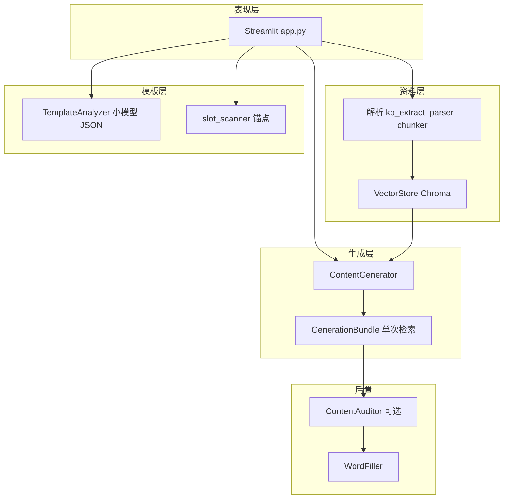

# 项目智能体模型：整体运作流程与框架说明

> 本文档面向「二次咨询优化方案」场景整理，描述当前仓库（xiangmushu）**真实实现**下的模型分工、数据流与路由逻辑，便于交给 GPT 等模型做架构/成本/质量维度的改进建议。

---

## 1. 项目定位（一句话）

基于 **Streamlit** 的单页应用：将多格式资料 **Embedding 入库（Chroma）**，对 Word 模板解析为若干 **填空任务（FillTask）**，对每个任务做 **RAG 检索 + 多模型路由生成**，可选 **审核 Agent** 校对后，用 **python-docx** 写回 `_已填写.docx`。**聊天/多模态**统一走 **阿里云百炼 OpenAI 兼容接口**；**嵌入**固定百炼 `compatible-mode/v1`；`enable_search` 仅在百炼通道内生效。统一经 `chat_completions_create`（强制 `enable_thinking=False`）。

---

## 2. 技术栈与入口

| 层级 | 技术 |
|------|------|
| 前端/编排 | Streamlit 1.33，`app.py` |
| LLM 客户端 | `openai` SDK；聊天 `openai_client_for_chat()` → 复星网关优先 |
| 向量库 | Chroma 0.5 持久化，`core/vector_store.py` |
| 嵌入 | `core/openai_embeddings.py` → `EMBEDDING_MODEL` |
| Word | `python-docx`，`core/filler.py` |
| 配置 | `config.py` + `.env`（`python-dotenv`） |

启动：`streamlit run app.py`。

---

## 3. 分层架构（逻辑视图）

---

## 4. 端到端主流程（用户视角）

1. **侧栏**：选知识库、生成强度（快速/普通/增强）、流式开关、联网补料、审核 Agent、高级参数（`top_k`、最大检索距离、默认字数等）。
2. **知识库管理**：上传 docx/pdf/pptx/图片 → 落盘 `data/historical` → 解析分块 → 写入当前 slug 对应 Chroma collection（`plan_kb__{slug}`）。
3. **模板配置**：上传 `.docx` → **有 `{{ANCHOR}}`** 则 `slot_scanner` 直接生成 `FillTask` 列表；**否则** `TemplateAnalyzer` 用小模型输出 JSON 任务列表（含段落/表格格与 `location_hint`）。
4. **生成预览**：对每个 `FillTask` 顺序执行：
   - `prepare_generation_bundle`：一次向量检索 → 组装 `messages` + `route_meta` + `ref_texts`（供生成与审核复用，不二次 search）。
   - `stream_from_bundle` 或 `generate_from_bundle`：按路由选模型调用 `chat.completions`（带 `max_tokens`、可选流式）。
   - 若开启审核：`ContentAuditor` 用审核模型对照 `ref_texts` + 表格上下文 + 草稿 → JSON（`pass` / `minor_fix` / `major_issue`）；可自动采纳修订稿或带 `issues` 再生成一轮。
5. **导出**：`WordFiller.fill_template` 将 `results` 与 `tasks` 对齐写回模板 → `data/outputs/..._已填写.docx`。

---

## 5. 模型角色一览（谁做什么）

| 角色 | 配置项（默认） | 典型调用点 | 说明 |
|------|----------------|------------|------|
| 嵌入模型 | `EMBEDDING_MODEL`（text-embedding-v3） | 入库、检索 query | 百炼 compatible，勿随聊天网关改 base |
| 小模型 | `SMALL_LLM_MODEL`（glm-5.1） | **强 RAG 时正文生成** | 温度 `TEMP_SMALL_LLM` |
| 模板分析 | `TEMPLATE_ANALYZE_MODEL`（glm-5.1） | 无 `{{锚点}}` 时 `TemplateAnalyzer` JSON | 纯文本 |
| 大模型 | `LARGE_LLM_MODEL`（qwen3.6-plus） | 弱检索、长段落、非强 RAG 正文 | 温度 `TEMP_LARGE_LLM` |
| 联网档 | `VISION_WEB_MODEL`（qwen3.6-plus） | `enable_search=True` | 复星 fosun G_doc 最高档 |
| 模板视觉 | `TEMPLATE_VISION_MODEL`（qwen3.6-plus） | PDF 页图 → layout JSON | 复星网关 ID |
| 表格/图视觉 | `TABLE_CELL_VISION_MODEL` / `VISION_EXTRACT_MODEL` | 表格切图、图片入库 | 默认同 qwen3.6-plus |
| 审核 | `AUDIT_LLM_MODEL`（qwen3.6-plus） | `ContentAuditor.audit` | **不传 enable_search** |

能力矩阵：`python smoke_test_models.py --probe-models` → `data/probe_gateway_models.md`。对话请求经 `core/dashscope_chat.py` 合并 `enable_thinking=False`；`enable_search` 网关失败时回落百炼。

---

## 6. 正文生成路由（核心决策）

记：

- `weak_kb`：空库或无检索命中。
- `low_similarity`：`best_similarity_est = clamp(1 - min(distance),0,1) < RETRIEVAL_WEB_SIMILARITY_THRESHOLD`（默认 0.3）。
- `use_plus`：**侧栏联网开** 且 `(weak_kb or low_similarity)` → 走 **联网档** + `enable_search`。

**非联网档**（`use_plus` 为假）时，在「有命中、非低相似、估算相似度 ≥ STRONG_RAG_SIMILARITY_FLOOR（默认 0.5）、非超长段落（段落字数 ≤ LONG_PARAGRAPH_WORDS 默认 600）、且 `USE_SMALL_LLM_FOR_STRONG_RAG` 为真」时，正文使用 **小模型**；否则使用 **大模型**（默认 gpt-5.4）。

`route_meta` 中会带：`generation_tier`（`small_rag` / `large` / `vision_web`）、`native_web_search`、`gen_max_output_tokens` 等，便于日志与 UI 展示。

---

## 7. 控费与上下文裁剪（当前策略）

- **检索片段**：`_format_kb` 每条正文最多 `RAG_SNIPPET_MAX_CHARS`（默认 1100）字符，超出截断说明。
- **输出上限**：`max_tokens ≈ min(GEN_MAX_TOKENS_HARD_CAP, word_limit × GEN_MAX_TOKENS_WORD_FACTOR + 常数)`，表格格字数在生成器内 capped。
- **单次检索复用**：`GenerationBundle.ref_texts` 同时用于生成与审核，避免重复 embedding 检索费用。

---

## 8. 表格与上下文增强

- `core/table_context.build_table_cell_context`：从模板 docx 按 `table_index, row, col` 抽取表头、左侧列、行首列、当前格原文，注入表格类任务的 user 提示，并与审核共用。
- 表格任务在提示词中强调：只填一格、短答、勿替其它格。

---

## 9. 关键代码文件（便于对照）

| 文件 | 职责 |
|------|------|
| `app.py` | UI、session、生成循环、审核与重试、下载 |
| `config.py` | 全部模型名、温度、检索/联网/控费开关 |
| `core/generator.py` | RAG、路由、`GenerationBundle`、流式/非流式 |
| `core/content_auditor.py` | 审核 JSON 与修订策略 |
| `core/table_context.py` | 表格局部上下文 |
| `core/template_analyzer.py` / `core/slot_scanner.py` | 任务列表来源 |
| `core/vector_store.py` | Chroma 检索与过滤 |
| `core/dashscope_chat.py` | 兼容封装 |
| `core/filler.py` | Word 回填 |

---

## 10. 当前能力边界（给优化方参考）

- **无多 Agent 并行编排框架**（如 LangGraph）；顺序 for 循环逐任务生成。
- **无对话记忆**：每任务独立，仅当次 `messages`。
- **联网**：`enable_search`（Qwen 联网档）；网关失败时 `dashscope_chat` 回落百炼；无 Tavily 聚合（`core/web_search.py` 为可选遗留）。
- **质量**：强依赖提示词 + RAG 片段质量；审核为可选单轮 JSON。

---

## 11. 可交给 GPT 的「优化咨询」提示（复制用）

请基于上文框架，从以下方向给出**可落地的**优化建议（可含伪代码或模块划分），并说明对 **成本（token/调用次数）**、**延迟**、**事实一致性**、**表格准确率** 的权衡：

1. 是否在「小模型强 RAG / 大模型 / 联网档」之间引入更细的分级（例如按章节类型、按 `description` 长度、按检索 margin）？
2. 审核 Agent 是否值得改为「仅表格/仅联网段触发」或「异步批量」以降低总延迟？
3. 检索侧：是否需要 HyDE、重排序、或按任务类型动态 `top_k`？
4. 长文档是否适合「大纲先大模型、段落并行小模型」等流水线？
5. 与百炼 compatible-mode 相关的参数（`max_tokens`、`enable_thinking`、模型 ID 命名）还有哪些推荐实践？

---

*文档版本：与仓库当前实现同步整理；模型默认值以 `config.py` 为准。*
