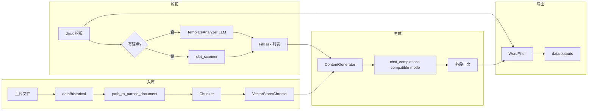

# 项目计划书：智能项目计划书（申报类文档）生成系统

**文档版本**：1.1  
**编制说明**：本文档基于当前代码仓库（xiangmushu）实现与配置整理，面向产品、研发与运维，说明项目背景、需求、架构、数据流、配置、验收与风险。较 1.0 版补充了需求分解、模块级说明、环境变量表、生成模式对照、排障与扩展指引。

---

## 一、项目简述（执行摘要）

本项目是一套面向**政府/企业科技类申报、基金说明书、合规披露类 Word 模板**的**本地化辅助写作系统**。用户将机构自有材料（历史文档、产品说明、培训稿等）沉淀为**向量知识库**，上传带空位或锚点的 **Word（.docx）模板**，系统通过**大语言模型 + RAG（检索增强生成）**按「填空任务」粒度（段落或表格单元格）逐段生成中文正文，并**自动回填**到 Word，输出可下载的成稿。

系统在**知识库薄弱**（空库、检索无命中）或**检索质量不足**（最佳命中估算相似度低于可配置阈值，默认 0.3）时，可在用户开启「联网补料」的前提下，切换至阿里云百炼 **OpenAI 兼容接口（compatible-mode）** 支持的 **`extra_body.enable_search`** 路径，由**联网档模型**（`VISION_WEB_MODEL`，须为支持内置搜索的 qwen-plus 系）补料。应用层提供**流式/非流式预览**、**生成强度预设**、**路由元数据日志**与界面上的**联网是否生效**提示，便于联调与质检。

---

## 二、建设背景与问题定义

### 2.1 背景

- 项目计划书、基金说明书、风险评估表等文档**版式固定、章节重复性高**，但**事实与合规约束极严**：机构全称、产品代码、费率区间、生效日期、监管状态、评级结论等必须与底稿一致。
- 纯大模型「从零撰写」易产生与机构材料不一致的**幻觉**；完全依赖人工从多份 PDF/Word 中摘抄则**周期长、易遗漏**。
- 机构侧常见现状：材料分散在 **Word / PDF / PPT / 扫描件或截图** 中，缺乏统一检索入口；模板由法务或合规提供，**必须以 Word 定稿**。

### 2.2 拟解决问题（问题陈述）

| 编号 | 问题 | 本项目对策 |
|------|------|------------|
| P1 | 多格式资料难以统一检索 | 解析 → 分块 → 向量入库（Chroma），按语义检索 |
| P2 | 模板空位形态多样（空白、下划线、表格格） | 锚点 `{{NAME}}` 精确绑定；无锚点时小模型 JSON 分析结构 |
| P3 | 长文档一次性生成不可控 | 按 `FillTask` 分段生成，每段绑定章节与字数上限 |
| P4 | 知识库覆盖不足时仍要写满 | 可选百炼内置联网；提示词要求无据处显式声明，不得杜撰关键事实 |
| P5 | 交付物必须是可编辑 Word | `python-docx` 结构化回填 + 轻量清理 Markdown 痕迹 |

### 2.3 建设必要性（价值）

- **缩短初稿周期**：在资料已入库前提下，批量段落与表格格可并行按模板顺序生成。  
- **提高可追溯性**：每段生成时日志记录路由（模型、是否请求 `enable_search`、kb 命中数、估算相似度等），便于审计与复现。  
- **降低对接成本**：统一走 OpenAI SDK 兼容百炼，便于与现有 Key 管理与网关策略对齐。

---

## 三、建设目标与范围

### 3.1 总体目标

交付一套可在**本机或内网**部署的 **Streamlit Web 应用**（单进程即可演示），完成「**资料入库 → 模板分析（可缓存）→ 分段 RAG 生成 → Word 导出**」闭环；默认对接**阿里云百炼** `compatible-mode/v1`（Embedding、聊天、联网档模型）。

### 3.2 功能范围（In Scope）— 分项说明

#### 3.2.1 知识库生命周期

- **注册表**：`data/kb_registry.json` 维护多库 `slug` 与展示名 `label`；Chroma 集合名规则为 `plan_kb__{slug}`（见 `core/kb_registry.py` 中 `collection_name_for_slug`）。  
- **新建 / 删除**：侧栏支持新建库（自动生成安全 slug）、删除库（需输入 `DELETE` 确认）；删除时可清理对应向量集合。  
- **入库**：支持 `docx` / `pdf` / `pptx` / 常见图片格式；文件落盘至 `data/historical/` 后再解析；同来源再次入库会先按来源删除旧片段再写入（见 `VectorStore.add_documents` 逻辑）。  
- **运维视图**：当前库片段总数、来源列表、按来源一键移除。

#### 3.2.2 多格式解析与分块

- **Word**：`DocumentParser` 按 body 子元素顺序遍历段落与表格，识别 Heading 样式或中文编号式标题，维护章节归属与表格在全文中的全局索引。  
- **PDF**：`pypdf` 抽取文本层；无文本层时给出引导文案（建议换图片或带文字层 PDF）。  
- **PPTX**：`python-pptx` 按页聚合可见文本。  
- **图片**：调用视觉相关能力将图像转为文字描述后再进入统一分块管线（`core/vision_extract.py`，经 `kb_extract.path_to_parsed_document`）。  
- **分块**：`Chunker` 对章节正文与表格文本做**滑动窗口**切分（默认单块约 700 字量级、重叠约 120 字），减少硬截断导致的语义断裂；元数据携带 `source`、`chapter`、`type` 等便于检索结果展示。

#### 3.2.3 模板分析与任务模型

- **优先路径—锚点**：正则 `\{\{([A-Za-z0-9_]+)\}\}` 扫描段落与表格单元格，为每个锚点生成 `FillTask`，`location_hint` 含 `anchor` 字符串，回填时全文替换该占位符。  
- **备选路径—LLM 分析**：无锚点时，`TemplateAnalyzer` 解析模板结构文本，并可附加「装饰性空位」程序化检测结果（空格/下划线等），由 **`SMALL_LLM_MODEL`** 输出严格 JSON 数组，字段映射为 `FillTask`（含 `table_index` 与 0 基 `row`/`col` 等）。  
- **缓存**：模板文件签名（文件名 + mtime）与 session 中已分析任务绑定，避免重复调用分析接口；用户可勾选「下次生成前强制重新分析」。

#### 3.2.4 生成与 RAG

- **查询构造**：`query = f"{task.target_chapter} {task.description}"`，与章节语义对齐。  
- **检索**：`VectorStore.search` 使用 Chroma `query_texts`，按 `n_results=top_k` 取回，并用 `max_distance` 过滤弱相关片段。  
- **提示词**：`SYSTEM_PROMPT` + `USER_PROMPT` 强调事实约束、禁止 Markdown、表格单元格短答等；无命中时在 user 侧追加「无有效知识库命中」相关约束。  
- **表格格任务**：`word_limit` 在生成器内 capped（如 120），提示模型只输出单格简短内容。

#### 3.2.5 联网补料（百炼内置）

- **开关**：侧栏「联网补料（百炼内置搜索）」映射 session `adv_use_tavily`（历史命名保留）。  
- **触发条件**（需开关为开）：`kb_empty` 或检索结果为空（弱库），**或** 有命中但 `best_similarity_est < RETRIEVAL_WEB_SIMILARITY_THRESHOLD`（默认 0.3，估算 `1 - min(distance)`）。  
- **请求形态**：使用 `VISION_WEB_MODEL`，并在 `chat_completions_create` 合并的 `extra_body` 中设置 `enable_search=True`。  
- **兼容封装**：`core/dashscope_chat.py` 在每次请求中统一写入 `enable_thinking=False`，避免部分模型默认深度思考导致耗时与费用上升；调用方传入的其它 `extra_body` 键保留。

#### 3.2.6 Word 回填与导出

- `WordFiller.fill_template`：逐对 `(FillTask, content)` 处理；锚点路径调用 `_replace_anchor_everywhere`；表格路径按 `location_hint` 定位单元格；段落路径按关键词与占位符模式匹配。  
- **后处理**：`strip_markdown_light` 去除常见 Markdown 符号；全表 `_ensure_table_readability` 改善可读性。  
- **输出路径**：`data/outputs/{模板名}_已填写.docx`；界面提供本次下载与「上次生成」常驻下载区（session 记录路径与文件名）。

### 3.3 非目标（Out of Scope）

- 多用户权限、组织架构、电子签章与用印流。  
- 实时协同编辑、批注与 Word 修订模式集成。  
- 自动合规裁决（是否可对外披露）— 仅辅助起草，**法定责任仍在人工复核**。  
- 非中文司法辖区的多语言合规模板包（当前提示词与语体以中文申报为主）。

---

## 四、角色、用户故事与使用场景

### 4.1 角色

| 角色 | 诉求 |
|------|------|
| 资料管理员 | 维护知识库、清理错误入库、控制来源质量 |
| 模板管理员 | 维护 `.docx` 模板、锚点命名规范、表格索引正确性 |
| 撰稿人 | 调生成强度、流式预览、导出 Word 后精修 |
| 技术运维 | 配置 Key、备份 Chroma、查看日志与冒烟脚本 |

### 4.2 用户故事（示例）

1. **作为资料管理员**，我希望把多份产品说明书 PDF 与内部 Word 一并入库，以便撰稿时统一检索。  
2. **作为模板管理员**，我希望在关键条款处使用 `{{RISK_DISCLOSURE}}` 锚点，避免 LLM 误判空位。  
3. **作为撰稿人**，我希望在「增强」模式下略放宽检索距离、略提高字数上限，以得到更充实的初稿，同时仍保留流式阅读体验。  
4. **作为运维**，我希望通过 `content_gen_route` 日志确认某段是否带 `enable_search`，以排除「侧栏开了联网但实际未走联网模型」的误解。

### 4.3 典型端到端场景

机构已有一份基金招募说明类 Word 模板（含大量表格），另有若干 PDF 产品条款。用户将 PDF 入库 → 上传模板 → 分析得到数十个 `FillTask` → 选择「普通」模式生成 → 下载 `_已填写.docx` → 法务在 Word 中核对数字与引用 → 定稿。

---

## 五、业务与操作流程（细化）

### 5.1 推荐顺序（界面 copy 一致）

侧栏确认知识库与 Key → **知识库管理** 入库 → **模板配置** 上传并分析 → **生成预览** 一键生成 → 下载 Word。

### 5.2 单次入库流程（技术视角）

1. 用户选择文件 → 写入 `data/historical/{原文件名}`。  
2. `path_to_parsed_document` 按扩展名分支 → `ParsedDocument`。  
3. `Chunker.chunk` 产出 `Chunk` 列表。  
4. `VectorStore.add_documents`：按来源删除旧 chunk → 分批 `add`（批量大小 `EMBED_ADD_BATCH_SIZE`）→ 每批带重试。  
5. 刷新统计与来源列表。

### 5.3 单次生成流程（技术视角）

1. 校验模板已选且任务列表可用（或触发分析）。  
2. 实例化 `ContentGenerator(vs)`，按 session 读取 `top_k`、`retrieval_max_distance`、`enable_web`、`stream` 等。  
3. 对每个 `FillTask`：`_build_chat_request` → 可选 `route_hook` 更新 UI → `chat_completions_create` 流式或非流式 → 累积文本。  
4. `WordFiller.fill_template` 写回磁盘 → 更新下载区 session。

---

## 六、需求规格摘要（可测试）

| ID | 需求描述 | 验收要点 |
|----|----------|----------|
| REQ-01 | 支持多知识库切换 | 切换后检索命中来自对应 `plan_kb__*` 集合 |
| REQ-02 | 支持多格式入库 | docx/pdf/pptx/图片至少各成功一例 |
| REQ-03 | 锚点模板优先 | 含 `{{A}}` 的模板不走 LLM 结构分析即可得到任务列表 |
| REQ-04 | RAG 检索可配 | 修改 top_k 与 max_distance 后命中条数与距离过滤行为变化 |
| REQ-05 | 生成强度预设 | 快速/普通/增强对应 session 默认值变化（见下表） |
| REQ-06 | 联网可观测 | 日志 `native_web_search` 与 UI 路由条一致 |
| REQ-07 | 输出可打开 | Word 无损坏，主要锚点/表格格内容已替换 |

---

## 七、技术架构

### 7.1 逻辑架构（文字分层）

- **表现层**：Streamlit（侧栏 + 三标签页 + 状态组件）。  
- **应用编排层**：`app.py` 中 session 键、模式冲刷 `_flush_pending_mode_defaults`、模板签名缓存。  
- **领域服务层**：模板分析、RAG 生成、Word 回填、注册表与向量存储。  
- **基础设施层**：Chroma 持久化、OpenAI 兼容客户端、环境配置。

### 7.2 部署架构（建议）

- **最小部署**：单机 `streamlit run app.py`，本机浏览器访问。  
- **内网部署**：同网段机器访问 `Network URL`；反向代理可加 HTTPS 与 Basic Auth（需自行配置，不在仓库内）。  
- **密钥**：仅通过环境变量或 `.env` 注入，不入库、不写日志明文。

### 7.3 主要依赖版本（见 `requirements.txt`）

| 包 | 版本约束 | 说明 |
|----|----------|------|
| streamlit | ==1.33.0 | Web UI |
| python-docx | ==1.1.2 | Word 读写 |
| chromadb | ==0.5.0 | 向量库 |
| openai | ==1.25.0 | 兼容百炼的客户端 |
| httpx | >=0.27,<0.28 | 与 openai 1.25 代理参数兼容 |
| python-dotenv | ==1.0.1 | 环境加载 |
| pypdf | >=4 | PDF 文本 |
| python-pptx | >=0.6.23 | PPTX 文本 |

---

## 八、核心模块与文件职责（详表）

| 路径 | 职责要点 |
|------|----------|
| `app.py` | 页面主题 CSS、`MODE_DEFAULTS`、三标签页、`_stream_three_line_window`（bundle+流式）、`route_slot`、审核与表格 `table_context` |
| `config.py` | API Key、各模型与温度、`AUDIT_LLM_MODEL`/`TEMP_AUDIT`、`RETRIEVAL_*`、路径常量 |
| `core/vector_store.py` | PersistentClient、按 slug 的 collection、`search` 距离过滤、按来源删除、Chroma SQLite seq_id 兼容补丁 |
| `core/openai_embeddings.py` | 带超时/重试的 Embedding 调用（供 Chroma embedding_function） |
| `core/generator.py` | `GenerationBundle`、`prepare_generation_bundle`、`prepare_bundle_from_evidence`、`stream_from_bundle`；`_build_chat_request`（query 扩展、表格上下文、`correction_hint`）；联网路由与日志 |
| `core/query_expander.py` | 无 API 检索 query 同义词扩展 |
| `core/task_grouper.py` | `TaskGroup`、`group_tasks`：表格行 / 章节分组 |
| `core/evidence_planner.py` | `retrieve_for_group`、`compress_evidence`、`format_evidence` |
| `core/batch_generator.py` | 表格行批量 JSON；解析失败降级由 `app.py` 处理 |
| `core/dashscope_chat.py` | `chat_completions_create` 统一 `enable_thinking=False` |
| `core/template_analyzer.py` | 锚点优先；否则小模型 JSON 解析为 `FillTask` |
| `core/parser.py` | Word 结构解析、`Section` / `ParsedDocument`、标题识别 |
| `core/slot_scanner.py` | 锚点扫描、装饰性空位检测、辅助 LLM 的提示拼接 |
| `core/fill_task.py` | 任务数据类定义 |
| `core/chunker.py` | 分块长度与重叠、表格文本展平 |
| `core/kb_extract.py` | 多格式入口 `path_to_parsed_document` |
| `core/kb_registry.py` | 注册表 CRUD、slugify、集合名 |
| `core/filler.py` | 回填、占位符正则、锚点替换、表格定位、`clean_table_answer` |
| `core/content_auditor.py` | 规则审核 `rule_audit`、选择性 `need_model_audit`、模型质检（默认 deepseek-v4-flash）、`should_apply_revision` |
| `core/table_context.py` | 从模板 docx 抽取表头与邻格文本 |
| `core/vision_extract.py` | 图片→文本描述（供入库） |
| `core/web_search.py` | 历史/可选外部搜索相关（主路径以百炼 `enable_search` 为主） |
| `smoke_test_models.py` | `--offline` 全量逻辑断言（路由、审核、query、分组证据、bundle 对齐、表格清洗、JSON 围栏）；无 `--offline` 时另跑流式/API/Chroma；详见 `docs/测试与验收.md` |

---

## 九、关键数据结构与约定

### 9.1 `FillTask`（`core/fill_task.py`）

| 字段 | 类型 | 含义 |
|------|------|------|
| `task_id` | str | UUID，用于日志关联 |
| `target_chapter` | str | 所属章节标题或「文档开头」 |
| `task_type` | str | `paragraph` 或 `table_cell` |
| `description` | str | 撰写指令（锚点任务为自动生成说明） |
| `location_hint` | dict | 锚点：`{"anchor": "{{NAME}}"}`；表格：`table_index`/`row`/`col`；段落：关键词等 |
| `word_limit` | int | 目标字数，表格格在生成器内会收紧 |

### 9.2 检索结果项（向量库返回）

- `text`：片段正文  
- `metadata`：至少含 `source`，可含 `chapter`、`kb_source_type`  
- `distance`：Chroma 返回的距离，**越小通常越相似**；用于 `max_distance` 过滤与联网低相似判定

### 9.3 Session 键（节选，`app.py`）

| 键 | 用途 |
|----|------|
| `SS_ACTIVE_KB` | 当前知识库 slug |
| `SS_TASKS` / `SS_TASKS_SIG` | 缓存的分析任务与模板签名 |
| `SS_GENERATION_MODE` | 快速/普通/增强 |
| `SS_LAST_OUT_PATH` / `SS_LAST_OUT_NAME` | 常驻下载 |

---

## 十、生成强度与默认参数对照

侧栏「生成强度」滑块在变更时会写入 `SS_PENDING_MODE_APPLY`，于 rerun 初期 `_flush_pending_mode_defaults` 刷入下列默认值（代码常量 `MODE_DEFAULTS`）：

| 模式 | top_k | 最大检索距离 | 联网开关默认 | 默认每段字数 | 流式默认 |
|------|-------|--------------|--------------|--------------|----------|
| 快速 | 3 | 0.7 | 关 | 300 | 关 |
| 普通 | 5 | 0.8 | 关 | 500 | 开 |
| 增强 | 10 | 0.9 | 开 | 800 | 开 |

说明：用户仍可在侧栏手动改单项高级参数；上述为**模式切换时批量写入的默认值**。

---

## 十一、联网与 RAG 路由（详述）

### 11.1 决策逻辑（实现一致）

记 `weak_kb = kb_empty or len(results)==0`。  
对非空 `results` 且各条含 `distance` 时，取 `best_hit_distance = min(distances)`，`best_similarity_est = clamp(1 - best_hit_distance, 0, 1)`。  
记 `low_similarity = best_similarity_est < RETRIEVAL_WEB_SIMILARITY_THRESHOLD`（默认 0.3）。  

当且仅当 **`enable_web`（侧栏联网）为真** 且 **`weak_kb or low_similarity`** 时：

- 使用 `VISION_WEB_MODEL` 与 `TEMP_WEB_GEN`  
- `extra_body["enable_search"] = True`  

否则使用 `LARGE_LLM_MODEL` 与 `TEMP_LARGE_LLM`，且 `extra_body` 不含搜索开关。

### 11.2 日志字段 `content_gen_route`（便于排障）

常见字段：`kb_empty`、`kb_hits`、`weak_kb`、`low_similarity`、`best_hit_distance`、`best_similarity_est`、`retrieval_web_similarity_threshold`、`enable_web_requested`、`native_web_search`、`model`、`extra_body_keys` 等。  
流式结束后另有 `content_gen_stream_done` 记录近似字符数。

### 11.3 与「增强模式默认开联网」的关系

「增强」会默认把 `adv_use_tavily` 设为 True，但若当段 `kb_hits` 充足且相似度估计高于阈值，仍可能 **`native_web_search=False`**（这是预期行为：路由由弱库/低相似驱动，而非仅由模式名字决定）。

---

## 十二、配置与环境变量（建议运维留存）

以下变量均通过 `os.getenv` 读取（`python-dotenv` 加载 `.env`）。未列出者以 `config.py` 源码为准。

| 变量名 | 作用 | 默认或备注 |
|--------|------|------------|
| `DASHSCOPE_API_KEY` | 百炼 Key | 与 `OPENAI_API_KEY` 二选一或并存，兼容客户端优先 DashScope |
| `OPENAI_API_KEY` | 兼容 OpenAI 系 Key | 同上 |
| `OPENAI_BASE_URL` | API 根地址 | 默认百炼 compatible-mode v1 |
| `EMBEDDING_MODEL` | 向量模型名 | 如 text-embedding-v3 |
| `SMALL_LLM_MODEL` | 模板分析等小任务 | 默认 qwen3.6-flash 档 |
| `LARGE_LLM_MODEL` | 主写作模型 | 默认 kimi-k2.6（可用环境变量覆盖） |
| `VISION_WEB_MODEL` / `VISION_MODEL` | 联网档模型 | 须支持 enable_search |
| `TEMP_*` | 各场景温度 | 见 config |
| `RETRIEVAL_MAX_DISTANCE` | 检索距离上限 | 默认 1.25 |
| `RETRIEVAL_WEB_SIMILARITY_THRESHOLD` | 低于则可走联网 | 默认 0.3 |
| `OPENAI_TIMEOUT` / `OPENAI_MAX_RETRIES` | 请求稳健性 | embedding 易慢，超时宜充足 |
| `EMBED_ADD_BATCH_SIZE` | 单次入库批大小 | 默认 12 |

---

## 十三、提示词与安全策略（摘要）

- **系统提示**：角色为资深申报撰写专家；强调事实须可核验、缺口显式声明、禁止 Markdown、语体符合政府/企业申报。  
- **用户提示**：注入章节、描述、字数、拼接后的检索片段。  
- **冲突策略**：若未来扩展同时注入网络与 KB，提示词约定**以知识库为准**。  
- **落地防护**：`WordFiller.strip_markdown_light` 减轻模型偶发格式污染。

---

## 十四、数据流概览（Mermaid）



---

## 十五、非功能性需求（扩展）

| 类别 | 要求 |
|------|------|
| 可维护性 | 路由与提示词集中在 `generator.py`，调参可不改 UI |
| 可观测性 | 标准 logging + UI `route_slot` |
| 稳健性 | 入库批重试、Chroma 兼容补丁、httpx 版本钉扎 |
| 安全 | Key 仅环境变量；不在前端硬编码 |
| 性能 | 流式降低首字等待；top_k 与批大小影响时延与费用 |

---

## 十六、实施计划（建议里程碑，细化）

| 阶段 | 周期（示意） | 工作内容 | 产出物 |
|------|----------------|----------|--------|
| M1 环境 | 0.5～1 天 | Python 环境、`pip install -r requirements.txt`、`.env`、首次启动 | 环境检查表 |
| M2 资料 | 1～2 天 | 选 3～5 份代表资料入库，检查来源与片段数 | 入库样例包 |
| M3 模板 | 2～4 天 | 1 份全锚点模板 + 1 份无锚点复杂表模板 | 模板规范 brief |
| M4 调参 | 3～5 天 | 联调 `RETRIEVAL_MAX_DISTANCE`、阈值、字数；记录日志样例 | 调参记录 |
| M5 联网 | 1～2 天 | 弱库/低相似下确认 `enable_search`；人工抽查联网段 | 联调签字单 |
| M6 交付 | 1 天 | 备份策略、冒烟脚本纳入发布检查 | 交付清单 |

---

## 十七、风险、假设与对策（扩展）

| 风险 | 假设 | 对策 |
|------|------|------|
| Chroma distance 与「相似度」口语不一致 | 余弦距离族近似 `1-d` | 文档化 + 阈值可配；对比人工判相关样本 |
| PDF 扫描件无文本层 | pypdf 无法 OCR | 引导改图片走视觉解析或外部 OCR |
| 表格合并单元格导致索引错位 | LLM 分析可能误标 | 优先锚点；复杂表拆模板 |
| 模型输出超长 | word_limit 仅为软约束 | 后处理截断策略可后续增强 |
| Windows 下 Streamlit 退出 asyncio 告警 | 运行时已知噪音 | 可忽略或升级 Streamlit；与业务无关 |

---

## 十八、验收与测试清单（扩展）

自动化与分层说明以专文 **[docs/测试与验收.md](docs/测试与验收.md)** 为准（含 L0/L1/L2、模块矩阵、侧栏键、日志关键字与手工抽检）。

**最小门禁**：`python smoke_test_models.py --offline` 须通过（退出码 0）。

### 18.2 手工抽检（摘要）

完整步骤见 `docs/测试与验收.md` 第六节：联网路由、锚点模板分析、Word 打开、知识库切换与初稿人工复核提示等。

---

## 十九、运维与备份

- **备份目录**：`chroma_db/`（向量索引）、`data/kb_registry.json`、`data/historical/`（原始资料）、`data/templates/`（模板）。  
- **恢复**：同版本 chromadb 与 embedding 模型一致前提下拷贝目录即可；跨版本需按 Chroma 迁移说明操作。  
- **监控建议**：记录每次生成的任务数、总字数、API 报错率（可自行在 `app.py` 外加日志上报）。

---

## 二十、扩展与二次开发指引

- **换模型**：仅改环境变量与 `config.py` 默认值，无需改业务代码（联网档须确认支持 `enable_search`）。  
- **换向量库**：抽象 `VectorStore` 接口处需重构，当前与 Chroma 绑定较深。  
- **增加 OCR**：在 `kb_extract` 的 PDF 分支接入第三方 OCR，再进入 `_synthetic_doc`。  
- **批量并行生成**：当前为顺序 for 循环，可在任务无顺序依赖时引入队列与并发（注意 API 限流）。

---

## 二十一、术语表

| 术语 | 含义 |
|------|------|
| RAG | Retrieval-Augmented Generation，检索增强生成 |
| weak_kb | 空库或无检索命中 |
| low_similarity | 估算相似度低于阈值，仍视为检索质量不足 |
| compatible-mode | 阿里云百炼提供的 OpenAI 兼容 HTTP API |
| FillTask | 单次生成与回填的最小工作单元 |

---

## 二十一点五、审核 Agent 与表格上下文（实现摘要）

- **表格上下文**：`core/table_context.build_table_cell_context` 根据 `table_index/row/col` 读取模板中表头行、本行行首列、左侧列及当前格原文，写入生成 `user_msg` 的「本格在 Word 表格中的上下文」小节，减少答非所问。  
- **单次检索复用**：`ContentGenerator.prepare_generation_bundle` 产出 `GenerationBundle`（含 `ref_texts`），流式 `stream_from_bundle` 与后续审核共用同一检索结果，避免重复 `search`。  
- **审核模型**：默认 `AUDIT_LLM_MODEL=deepseek-v4-flash`（`config.py` / 环境变量可覆盖），温度 `TEMP_AUDIT`；侧栏「启用审核 Agent」「审核 major 时自动重试生成 1 次」。  
- **策略**：`minor_fix` 且 `revised_content` 长度合规时自动采用修订稿；`major_issue` 且开启重试时，将 `issues` 注入 `correction_hint` 再生成一次并二次审核。日志关键字 `content_gen_audit`。  
- **规则优先审核**：`rule_audit` 与 `need_model_audit` 减少低风险段落的审核模型调用；详见 `core/content_auditor.py`。  
- **分组预检索与证据压缩**：`group_tasks` + `retrieve_for_group` + `prepare_bundle_from_evidence`（`app.py` 生成前）；表格行可选 `batch_generate_table_row`。验收与离线用例见 **[docs/测试与验收.md](docs/测试与验收.md)**。

## 二十二、结语

本系统在**单一仓库**内完成了从多格式资料到 Word 定稿链路的**主要工程化环节**，通过 **RAG + 可解释路由 + Word 结构化回填** 平衡了「效率」与「事实约束」。**正式用于对外申报或监管报送前，必须进行人工复核与法务合规审查**；本文档与代码版本应同步迭代，重大参数变更需更新验收用例与运维说明。

---

**附录 A：仓库关键路径一览**

```
xiangmushu/
  app.py                 # Streamlit 入口
  config.py              # 全局配置
  requirements.txt
  smoke_test_models.py
  docs/
    测试与验收.md        # L0/L1/L2 测试说明与矩阵
  core/
    generator.py         # GenerationBundle / 生成
    query_expander.py
    task_grouper.py
    evidence_planner.py
    batch_generator.py
    content_auditor.py   # 审核 Agent
    table_context.py     # 表格邻格上下文
  data/
    kb_registry.json
    historical/          # 上传落盘
    templates/           # docx 模板
    outputs/             # 生成结果
  chroma_db/             # 向量持久化
```

**附录 B：文档修订记录**

| 版本 | 日期 | 说明 |
|------|------|------|
| 1.0 | 初版 | 总览与里程碑 |
| 1.1 | 扩充 | 需求表、模块表、数据流、配置表、排障与扩展 |
| 1.3 | 2026-05-14 | 测试专文 `docs/测试与验收.md`；扩展 `smoke_test_models.py --offline`；模块表与 §十二/§十八同步 |
